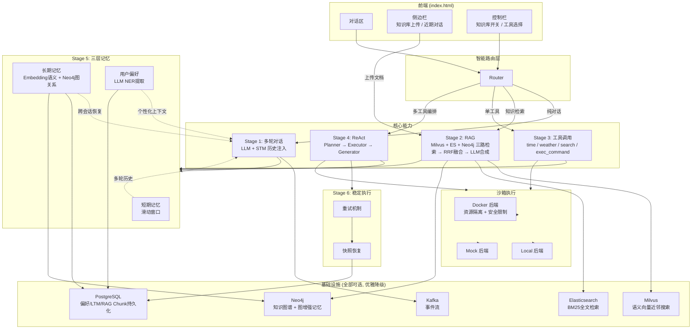
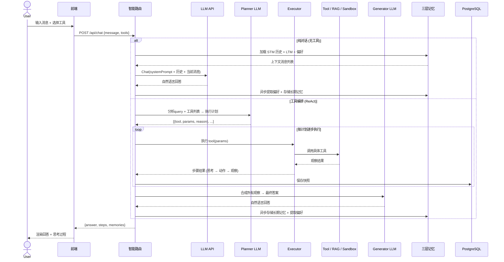
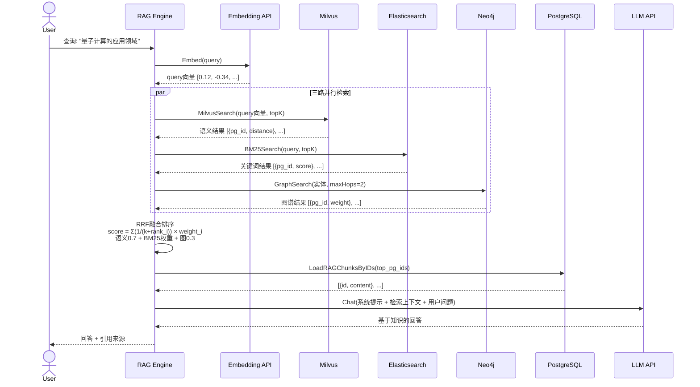

# AGI-assistant：多模态智能体系统

AGI-assistant 是一个面向个人与企业的多模态智能体系统，融合了检索增强生成（RAG）、三层记忆、知识图谱、沙箱执行与可恢复执行流，支持多轮对话、知识检索、工具调用与复杂推理。系统具备高可用性、可扩展性与工程落地能力。

## 项目特性

- **多阶段智能体核心**：支持纯对话、RAG 检索、单工具调用、多工具编排（ReAct）等多种智能体模式，自动路由。
- **RAG 检索增强生成**：融合 Milvus 语义向量、Elasticsearch 关键词、Neo4j 知识图谱，三路 RRF 融合排序，自动降级，支持文档分块与异步实体关系抽取。
- **三层记忆系统**：短期记忆（滑动窗口）、长期记忆（Embedding/TF）、用户偏好（LLM+规则），支持去重、合并、衰减、过期淘汰。
- **图增强记忆**：长期记忆叠加 Neo4j 图层，支持 FOLLOWS、SIMILAR_TO、CAUSES、BELONGS_TO 等关系，提升历史联想与推理能力。
- **工具链与可恢复执行**：内置时间、天气、搜索、RAG 检索、命令执行等工具，支持 ReAct 规划-执行-生成流程，任务快照与重试机制保障稳定性。
- **沙箱执行**：支持 Docker / Local / Mock 三种沙箱后端，资源限制（CPU/内存/PID/网络），命令白名单安全校验。
- **高可用基础设施**：PostgreSQL 持久化、Milvus/ES/Neo4j/Kafka 可选，自动优雅降级，适配多种部署环境。

---


## 整体架构图




## 核心流程时序图




## RAG 三路混合检索流程图




## 记忆系统详细流程图

```mermaid
sequenceDiagram
    actor User
    participant Agent as Agent
    participant STM as 短期记忆<br/>(滑动窗口 N×2)
    participant LLM as LLM API
    participant EMB as Embedding API
    participant LTM as 长期记忆<br/>(Embedding+TF双层)
    participant GRAPH as Neo4j图增强
    participant PREF as 用户偏好<br/>(LLM NER+规则双重)
    participant PG as PostgreSQL

    Note over User,PG: ═══════════ 服务启动: 跨会话恢复 ═══════════
    Agent->>PG: LoadPreferences(userID)
    PG-->>Agent: 历史偏好 [{key, value}, ...]
    Agent->>PREF: SaveBatch(恢复偏好到内存)
    Agent->>PG: LoadLongTermItems()
    PG-->>Agent: 历史LTM [{id, content, embedding, importance}, ...]
    Agent->>LTM: StoreItem(逐条恢复到内存索引)
    Note right of LTM: 重建TF词表<br/>恢复Embedding向量
    Agent->>GRAPH: 重建记忆节点与关系
    Agent->>STM: 初始化空窗口

    Note over User,PG: ═══════════ 每轮对话: 读取阶段 ═══════════
    User->>Agent: "你好，我叫小明，我喜欢打篮球"
    Agent->>STM: Add(user, 消息)

    Agent->>LTM: Recall(query, topK=3, queryEmbedding?)
    alt Embedding API 可用
        Agent->>EMB: Embed(query)
        EMB-->>LTM: query向量
        loop 遍历所有LTM条目
            LTM->>LTM: cosine(queryEmb, itemEmb)
            LTM->>LTM: score = sim×0.7 + importance×0.3
            alt score ≥ 0.4 阈值
                LTM->>LTM: 更新item.LastAccessed
                LTM->>LTM: 加入候选集
            else score < 0.4
                Note right of LTM: 过滤噪声，不注入
            end
        end
    else 降级: TF词袋
        LTM->>LTM: buildVocab(query) 扩充词表
        LTM->>LTM: textToVector(query) → TF向量
        loop 遍历所有LTM条目
            LTM->>LTM: cosine(queryTF, itemTF)
            LTM->>LTM: score = sim×0.7 + importance×0.3
        end
    end
    LTM-->>Agent: 召回记忆 [{content, score}, ...]

    Agent->>GRAPH: GraphRecall(相关节点, maxHops=2)
    GRAPH-->>Agent: 图扩展记忆 [关联历史, ...]

    Agent->>PREF: BuildContext()
    PREF-->>Agent: "【用户偏好】\n姓名: 小明\n喜好: 篮球"

    Agent->>LLM: Chat(systemPrompt + 偏好 + LTM记忆 + 图记忆 + STM历史 + 当前消息)
    LLM-->>Agent: "你好小明！喜欢篮球很棒..."

    Note over User,PG: ═══════════ 每轮对话: 写入阶段 ═══════════
    Agent->>STM: Add(assistant, 回答内容)

    Agent->>LTM: Store(用户消息, importance, embedding?)
    alt Embedding API 可用
        Agent->>EMB: Embed(消息内容)
        EMB-->>LTM: 语义向量
        loop 去重检测: vs 每条已有条目
            LTM->>LTM: cosine(newEmb, itemEmb)
            alt sim ≥ 0.95 (去重阈值)
                LTM->>LTM: 更新已有条目重要性+访问时间
            else sim < 0.95
                LTM->>LTM: 新增条目
            end
        end
        LTM->>PG: SaveLongTermItem(content, vector, importance)
    else 降级: TF词袋
        LTM->>LTM: buildVocab + textToVector
        LTM->>PG: SaveLongTermItem(content, nil, importance)
    end

    Agent->>GRAPH: 新增记忆节点 + 关系<br/>(FOLLOWS/SIMILAR_TO/CAUSES)

    par 异步: LLM NER偏好提取
        Agent->>LLM: "从以下对话提取用户偏好: ..."
        LLM-->>Agent: {"姓名":"小明","喜好":"篮球"}
        Agent->>PREF: SaveBatch(kvs)
        PREF->>PG: SavePreference(key, value)
    and 同步: 规则兜底 (立即生效)
        Agent->>PREF: ExtractAndSave("我喜欢打篮球")
        PREF-->>Agent: key="喜好", value="打篮球", ok=true
        PREF->>PG: SavePreference(key, value)
    end

    Note over User,PG: ═══════════ 合并触发: 每5条新记忆 ═══════════
    LTM->>LTM: NeedConsolidation()?
    alt storeCount ≥ TriggerInterval(5)
        Note over LTM: Phase 1: 重要性衰减
        LTM->>LTM: importance × DecayRate^days<br/>(每日×0.995, 30天≈0.86)
        Note over LTM: Phase 2: 去重 + 合并
        loop 两两比较相似度
            alt sim ≥ 0.95 (DedupThreshold)
                LTM->>LTM: 保留importance更高的, 删除另一条
                LTM->>PG: DELETE removed IDs
                LTM->>GRAPH: 删除对应图节点
            else sim ≥ 0.80 (SimilarityThreshold)
                LTM->>LTM: mergeItems(): 内容拼接/保留较长
                LTM->>PG: UPDATE merged item, DELETE被合并条目
                LTM->>GRAPH: 合并图关系, 保护高中心度节点
            end
        end
        Note over LTM: Phase 3: 过期淘汰
        loop 检查每条记忆
            alt days > TTL(30) AND importance < Min(0.3)
                LTM->>LTM: 删除过期条目
                LTM->>PG: DELETE expired IDs
            end
        end
        LTM->>LTM: rebuildVocab() 重建词表
    end

    Note over User,PG: ═══════════ 会话结束 ═══════════
    Note right of STM: 进程消亡, STM清除<br/>不持久化（设计如此）
    Note right of LTM: 已实时持久化到PG<br/>Consolidation结果已同步
    Note right of GRAPH: 图关系已持久化到Neo4j<br/>下次启动恢复
    Note right of PREF: 已实时持久化到PG<br/>下次启动LoadPreferences恢复
```




## 技术实现亮点

- **RAG 检索增强**：
    - 支持三路混合检索（Milvus 语义向量、ES BM25 关键词、Neo4j 知识图谱），RRF 融合排序。
    - 文本分块采用窗口重叠，提升召回覆盖率。
    - 检索模式自动切换，单路故障自动降级，支持企业级高可用。
    - 检索结果结构化，便于 LLM 合成与追溯。

- **三层记忆系统**：
    - 短期记忆：滑动窗口保存最近 N 轮对话。
    - 长期记忆：Embedding/TF 双层，支持去重、合并、衰减、过期淘汰。
    - 偏好记忆：LLM+规则自动提取用户偏好，持久化跨会话恢复。

- **图增强记忆**：
    - 记忆写入时自动建立时序（FOLLOWS）、相似（SIMILAR_TO）等关系。
    - 支持图扩展召回，发现间接关联历史记忆。
    - 合并淘汰时保护高中心度节点，防止核心知识丢失。

- **智能体与工具链**：
    - 路由优先级：ReAct 复合推理 > 单工具 > RAG 检索 > 纯对话。
    - 工具链支持自定义扩展，RAG 检索作为知识库工具无缝集成。
    - ReAct 规划-执行-生成流程，任务快照与重试机制保障稳定性。

- **沙箱执行**：
    - 支持 Docker（资源隔离 + 安全限制）、Local（直接执行）、Mock（测试）三种后端。
    - 命令长度限制、白名单校验、资源配额（CPU/内存/PID/网络/只读文件系统）。

- **工程与基础设施**：
    - PostgreSQL 持久化所有关键数据。
    - Milvus/ES/Neo4j/Kafka 可选，自动降级，适配多种部署环境。
    - 前后端解耦，支持多端接入。

---

## 快速开始

### 本地运行

```bash
# 1. 安装 Python 依赖
pip install -r requirements.txt

# 2. 启动基础设施（需要 Docker Desktop）
docker compose up -d

# 3. 启动应用
python main.py

# 4. 访问 http://localhost:8090
```

### Docker 部署

```bash
# 一键构建 + 启动全部服务
docker compose up -d --build
```

### 配置

编辑 `config/config.yaml`，填入 API Key：

- `llm.api_key` — 火山引擎 Ark 对话模型 API Key（也支持 OpenAI/DeepSeek 等兼容接口）
- `embedding.api_key` — 火山引擎 Embedding 模型 API Key
- `search.api_key` — Tavily 搜索 API Key（可选）

> 所有基础设施（Milvus/PG/ES/Kafka/Neo4j）均为可选，连接失败自动降级为内存模式，不影响启动。

---

## 目录结构

```
├── config/                    配置加载（YAML → dataclass）
│   ├── config.py
│   └── config.yaml
├── src/
│   ├── domain/                领域层（纯逻辑，无外部依赖）
│   │   ├── memory/            三层记忆系统（短期/长期/偏好+图增强）
│   │   ├── rag/               RAG 引擎（三路混合检索+RRF融合）
│   │   ├── sandbox/           沙箱执行（安全校验+策略编排）
│   │   ├── promptctx/         Schema驱动提示词组装器（12个源）
│   │   ├── graph/             任务DAG（Kahn拓扑排序）
│   │   ├── knowledge/         知识图谱抽取与存储
│   │   └── tool.py            Tool/Param定义
│   ├── infrastructure/        基础设施层
│   │   ├── platform/          PG/Milvus/ES/Kafka/Neo4j连接器
│   │   ├── persistence/       数据库仓储层（5个Repo）
│   │   ├── sandbox/           Docker/Local/Mock执行器
│   │   ├── tool/              内置工具/MCP/Tavily搜索
│   │   ├── llm.py             OpenAI兼容LLM客户端
│   │   └── eventbus.py        事件总线
│   ├── application/chat/      应用层
│   │   ├── core_agent.py      UnifiedAgent（初始/路由/4种模式）
│   │   ├── ctx_builder.py     上下文构建+LLM调用
│   │   └── ...                工具注册/记忆栈/任务运行时
│   └── interfaces/http/       FastAPI路由（10个端点+SSE流）
├── frontend/                  单文件前端 HTML
├── main.py                    入口
├── requirements.txt           Python依赖
├── pyproject.toml             项目元数据
├── docker-compose.yml         基础设施编排
└── Dockerfile                 应用容器镜像
```

---

## 致谢

本项目受多模态智能体、RAG、知识图谱、记忆增强等前沿研究启发，欢迎交流与合作。
