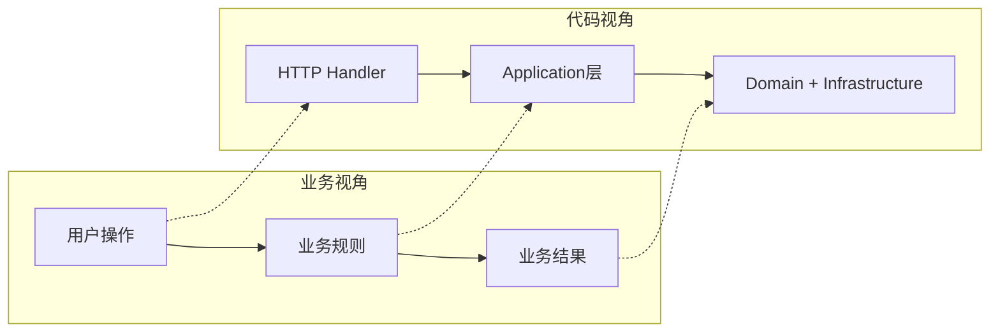

## 业务流程理解模板

帮助实习生从业务视角理解项目，建立"业务 → 代码"的映射关系。

---

### 业务理解三步法

#### 第一步：搞清楚"这个项目服务谁"
- 用户是谁？（C端用户 / B端运营 / 内部系统）
- 用户用它做什么？（核心场景 2-3 个）
- 用户最常做的操作是什么？

#### 第二步：搞清楚"核心业务流程"
- 用「用户故事」描述：作为 XXX，我想要 XXX，以便 XXX
- 画出业务流程图（纯业务视角，不涉及代码）
- 标注"正常流程"和"异常流程"

#### 第三步：搞清楚"业务概念 → 代码模块"的映射
- 每个业务概念对应哪个代码模块？
- 每个用户操作对应哪个接口？
- 业务规则写在哪一层？

---

### 业务场景描述模板

```
## 场景名称：{场景名}

### 用户故事
> 作为 {角色}，我想要 {操作}，以便 {目的}

### 前置条件
- {条件1}
- {条件2}

### 正常流程
1. 用户 {操作1}
2. 系统 {响应1}
3. 用户 {操作2}
4. 系统 {响应2}
5. 结果：{最终结果}

### 异常情况
| 异常 | 系统行为 | 用户看到什么 |
|------|---------|-------------|
| {异常1} | {处理方式} | {提示信息} |
| {异常2} | {处理方式} | {提示信息} |

### 对应代码
| 业务步骤 | 代码位置 | 关键函数 |
|---------|---------|---------|
| {步骤1} | `{文件路径}` | `{函数名}` |
| {步骤2} | `{文件路径}` | `{函数名}` |
```

---

### 业务术语表模板

| 业务术语 | 大白话解释 | 对应代码中的命名 | 所在模块 |
|---------|-----------|----------------|---------|
| {术语1} | {解释} | {变量名/类名} | {模块} |
| {术语2} | {解释} | {变量名/类名} | {模块} |

---

### 业务-代码映射图模板



---

### 常见业务模式识别

| 业务模式 | 特征 | 代码中的体现 | 理解要点 |
|---------|------|-------------|---------|
| CRUD | 增删改查 | handler/domain/infrastructure 三层 | 最基础的模式，先看懂这个 |
| 状态机 | 有明确的状态流转 | 状态枚举 + 转换规则 | 画出状态图就懂了 |
| 事件驱动 | 一个操作触发多个后续动作 | 消息队列/回调/观察者 | 找到"谁发事件、谁收事件" |
| Agent 路由 | AI 智能分流 | 路由模式选择（Chat/Tool/RAG/ReAct） | 理解每个模式的触发条件和处理流程 |
| RAG 检索 | 先查资料再回答 | 检索增强生成管道 | 追踪 query → rewrite → search → RRF → rerank → generate |
| 规则引擎 | 业务规则可配置 | 配置表 + 规则解析器 | 先看配置格式，再看解析逻辑 |
| 流程编排 | 多步骤按顺序执行 | Pipeline/Chain 模式 | 找到步骤列表和执行顺序 |
| 资格校验 | 判断用户是否满足条件 | 条件列表 + 逐个检查 | 找到所有条件和判断逻辑 |

---

### 理解业务的快捷方式

1. **看 API 路由 / 接口定义** — 接口名和参数名往往直接反映业务含义（FastAPI: `/docs` 自动生成 Swagger 文档）
2. **看错误码定义** — 错误码列表就是"所有可能出错的情况"的清单
3. **看配置文件** — 配置项名称暗示了可调整的业务参数（如 `config.yaml`）
4. **看测试用例** — 测试用例就是"业务场景"的代码化表达
5. **看 git commit message** — 提交信息往往包含需求背景
6. **看管理台/运营后台** — 如果有的话，运营后台的功能就是业务的全貌
